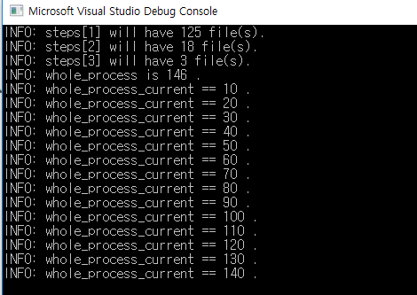

# External Merge Sorting
When computer's ram size is restricted but file size is bigger than ram size, you can't merge sorting basic algorithms
So, computer should sorting step by step as memory size.
Specific information bellow site
[External Merge Sorting](https://minimalcodes.wordpress.com/2016/05/29/sorting-large-number-of-elements-external-sort-in-cpp/)

## Files
- externalMergeSecond.cpp : main()
- Data.cpp : data structure
-  FileHandler.cpp : file wrting, reading
-  Util.cpp : sorting, other utilities     
## Program Options
```
'd' option: delete other files except for result a file
```
## Image
