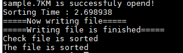

# Parallell Quicksort
Normal quicksort is slow and W(n) is n^2      
## parallell_quicksort_dualpivot.c   
```
eight thread    
dualpivot selection    
```      
     
## parallell_quicksort_merge.c
```    
eight thread    
merge + quicksort     
```    
    
## parallell_quicksort_merge_dualpivot.c
```
eight thread    
dualpivot selection    
merge + quicksort    
```    
    
## make_sample.c
```
70000000 random number sample data   
```       